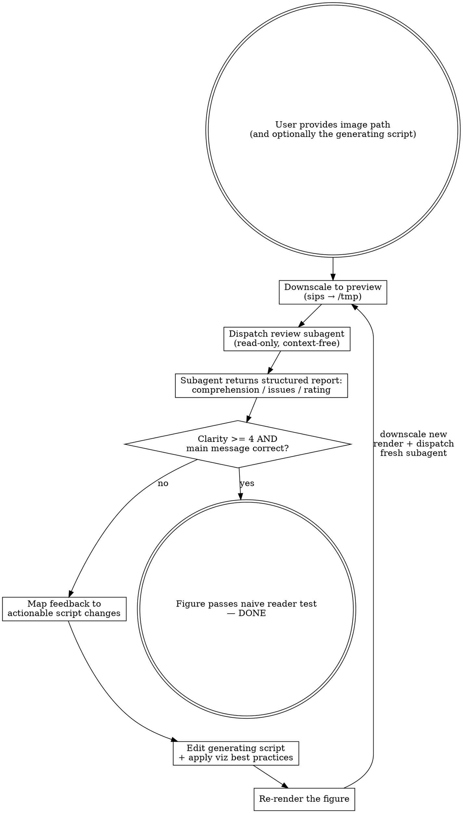
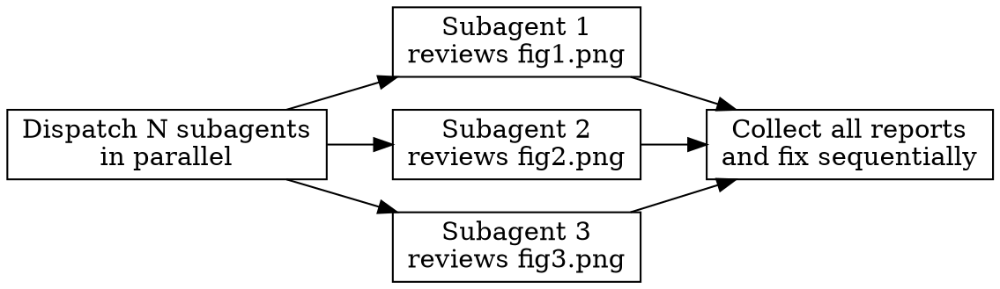

# Visualization Check

Iterative review cycle using a **context-free subagent** as a naive reader. The subagent sees ONLY the image — no study context, no axis explanations, no expected conclusions. If the subagent can't understand the figure, a real reader won't either.

## When to Use

- After generating a figure (R, Python, or any tool)
- Before submitting figures for publication
- When a plot feels unclear but you can't pinpoint why
- When you want objective "fresh eyes" feedback

## Workflow



## Step 0: Preprocess Image for Subagent

**High-DPI publication figures (300 DPI, 2000-4500px wide) consume excessive context tokens and can cause subagents to hit context limits.** Always downscale before dispatching.

### Preprocessing Command

Use `sips` (built into macOS) to create a preview copy:

```bash
sips --resampleWidth 800 "{ORIGINAL_PATH}" --out "/tmp/viz_check_preview.png"
```

### Rules

- **Always downscale** before dispatching, regardless of file size. This is cheap and prevents failures.
- **Preview goes to `/tmp/`** — never modify the original figure.
- **Use the preview path** (`/tmp/viz_check_preview.png`) in the subagent prompt, not the original.
- **Re-preprocess after each re-render** — the original changes, so the preview must be regenerated.
- For **multi-figure parallel mode**, use unique filenames: `/tmp/viz_check_preview_{basename}.png`

### Multi-Figure Preprocessing

When reviewing multiple figures in parallel, batch-preprocess first:

```bash
for fig in path/to/figures/*.png; do
  basename=$(basename "$fig")
  sips --resampleWidth 800 "$fig" --out "/tmp/viz_check_preview_${basename}"
done
```

Then dispatch each subagent with its corresponding `/tmp/viz_check_preview_{basename}.png`.

## Step 1: Dispatch Naive Reader Subagent

**You MUST dispatch a review subagent for each review round.** Do not attempt to self-review — the whole point is context-free eyes.

### Subagent Configuration

| Setting | Value | Why |
|---------|-------|-----|
| `subagent_type` | `Explore` | **Read-only tools only** (Read, Glob, Grep). Prevents accidental modifications to scripts or figures. |
| `max_turns` | `3` | Subagent only needs to read the image and write the report. |
| Resume | **NEVER** | Each round uses a fresh subagent. Never resume a previous reviewer. |

### Subagent Prompt Template

```
You are a naive reader seeing this figure for the first time. You have NO context about
the study, data, or purpose. Read the image file, then produce a structured review.

## Image
Read the image at: {PREVIEW_PATH}

## Structured Review Template

### A. Comprehension (what you understood)
1. What is this figure showing? Describe in your own words.
2. What are the axes/labels? Summarize each.
3. What is the main message or takeaway?

### B. Confusion Points (what is unclear)
List EVERY element that is unclear, ambiguous, or hard to read. Be specific —
reference position (top-left, bottom panel, etc.) and quote any problematic text.

### C. Visual Quality Checklist
For each item, mark PASS / FAIL / N/A:
- [ ] Colors distinguishable (also in grayscale?)
- [ ] All text readable at this size (no overlapping labels?)
- [ ] Reference lines / thresholds labeled
- [ ] No unnecessary chart junk (gridlines, borders, decorations)
- [ ] Legend (if any) self-explanatory without context
- [ ] Good data-ink ratio (data vs non-data elements)
- [ ] Abbreviations spelled out or self-evident

### D. Clarity Rating
Rate 1 (incomprehensible) to 5 (instantly clear). Justify in one sentence.

### E. Top 3 Recommended Fixes
Prioritized list of the most impactful improvements.
```

### Context Contamination Rules

**Do NOT include in the subagent prompt:**
- Study description or purpose
- What the axes represent
- Expected conclusions or trends
- Variable names or domain terminology explanations
- Prior feedback from previous iterations
- The generating script or its path

Even saying "this is a survival curve" gives away too much. Let the subagent figure it out.

## Step 2: Analyze Feedback

Map the subagent's confusion points to specific script changes:

| Subagent Says | Likely Fix |
|---------------|------------|
| "Can't read axis labels" | Increase `axis.text` size, reduce tick density |
| "Don't know what colors mean" | Add/improve legend, use more distinct palette |
| "Too many lines/elements" | Simplify: fewer series, facet instead of overlay |
| "What's this dotted line?" | Label reference lines directly on plot |
| "Can't tell the trend" | Increase line width, reduce noise, add smoothing |
| "Axes are confusing" | Better axis titles, consider log scale, add units |
| "Too cluttered" | Remove gridlines, reduce chart junk, increase whitespace |
| "Colors look similar" | Use colorblind-safe palette (viridis, okabe-ito) |
| "Abbreviation unclear" | Spell out on first use, or add subtitle/footnote |

## Step 3: Apply Data Visualization Best Practices

### Hierarchy of Fixes (Most Impact First)

1. **Labels and titles**: Self-explanatory axis labels WITH units. No abbreviations.
2. **Reference lines**: Label directly on plot (not just in legend).
3. **Color**: Colorblind-safe, distinguishable in grayscale. Use `scale_color_viridis_d()` or Okabe-Ito.
4. **Simplify**: Remove redundant gridlines, borders, backgrounds. `theme_minimal()` or `theme_classic()`.
5. **Text size**: All text readable at final print size (typically 8-10pt minimum).
6. **Data-ink ratio**: Maximize data, minimize decoration.
7. **Direct labeling**: Label lines/points directly instead of using legends when possible.

### R-Specific Patterns

```r
# Good defaults for publication figures
theme_publication <- theme_minimal(base_size = 14) +
  theme(
    axis.title = element_text(size = 14, face = "bold"),
    axis.text = element_text(size = 12),
    legend.position = "bottom",
    panel.grid.minor = element_blank(),
    plot.title = element_text(size = 16, face = "bold")
  )

# Colorblind-safe palettes
scale_color_viridis_d()           # Sequential
scale_color_brewer(palette = "Set2")  # Categorical
```

## Step 4: Re-render and Iterate

1. Edit the generating script with fixes (fix the SOURCE, not the PNG)
2. Re-run the script to produce updated figure
3. **Re-preprocess**: `sips --resampleWidth 800` the new render to `/tmp/` (the old preview is stale)
4. **Dispatch a NEW subagent** (fresh context, same template) pointing at the new preview
5. **Exit condition**: Subagent rates clarity >= 4/5 AND identifies the main message correctly

Typical iterations: 2-3 rounds.

## Multi-Figure Mode

When checking multiple independent figures, **dispatch review subagents in parallel** — one per figure. Each subagent touches only its own image (no shared state).



For figures that share visual consistency requirements (same color scheme, axis style), do a **final synthesis step** after individual reviews to check cross-figure consistency.

## Common Pitfalls

- **Leaking context to subagent**: The #1 failure mode. Review your prompt before dispatching.
- **Reusing the same subagent**: Prior feedback contaminates. Always dispatch fresh.
- **Over-iterating**: If the subagent gets the main message right but nitpicks aesthetics, you're done.
- **Ignoring the generating script**: Fix the SOURCE (R/Python script), not the PNG. Ensures reproducibility.
- **Using general-purpose subagent**: Use `Explore` (read-only) to prevent the reviewer from accidentally modifying files.

## Quick Start

```
/visualization-check path/to/figure.png
```

If you also know the generating script:

```
/visualization-check path/to/figure.png --script path/to/plot_script.R
```

The agent will:
1. Find the generating script (if not provided, search for it)
2. **Downscale to `/tmp/` preview** (sips --resampleWidth 800)
3. Dispatch naive reader subagent with preview path (read-only, context-free)
4. Collect structured feedback report
5. Edit the script and re-render
6. Re-preprocess + dispatch new subagent for re-review
7. Repeat until clarity >= 4/5
