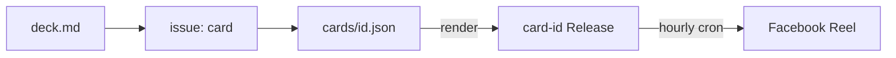
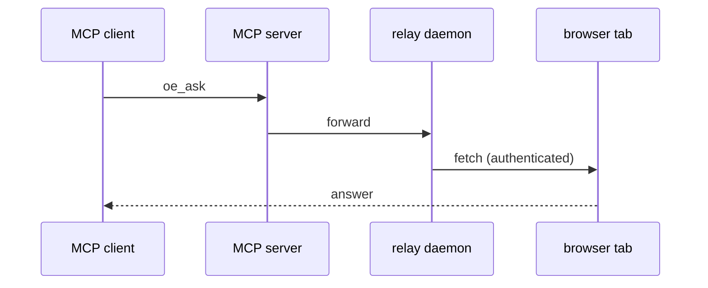
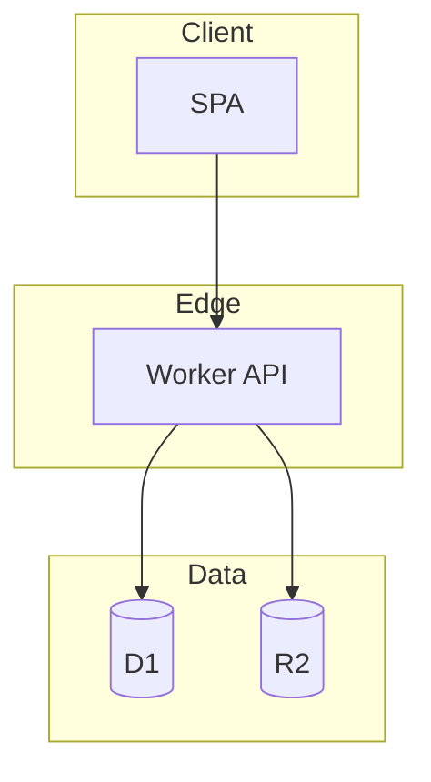

# Mermaid in GitHub wikis

GitHub renders mermaid natively in wiki pages from a fenced ` ```mermaid ` block — no
plugin, no image. Use diagrams where a picture genuinely beats prose: the at-a-glance flow
on Home, the architectural-style diagram on the architecture page, a sequence for a tricky
protocol. One good diagram per page is plenty; do not decorate.

## Picking the diagram type

| The thing you're showing                          | Diagram        |
| ------------------------------------------------- | -------------- |
| Components / data flow / pipeline stages          | `flowchart`    |
| A request's round-trip across processes/services  | `sequenceDiagram` |
| Build/deploy or issue->PR->release state machine  | `stateDiagram-v2` |
| Data model / table relationships                  | `erDiagram`    |
| Phases over time (roadmap)                         | `gantt` (sparingly) |

## Patterns

**Component / pipeline flow** (Home "at a glance", or the style diagram):



**Cross-process round-trip** (a mediated/distributed style — e.g. an MCP relay):



**Layered / grouped components** (subgraphs = the boundaries in the architecture page):



## Rules that keep it rendering

- Open with the diagram type on its own line (`flowchart LR`, `sequenceDiagram`, ...).
- Keep node **labels plain**: avoid unescaped `()`, `:`, `#`, `<`, `>`, `"` inside `[...]`.
  Prefer `[Worker API]` over `[Worker (API)]`; if you need parentheses, wrap the whole
  label in quotes: `A["fetch (authenticated)"]`.
- Give nodes short IDs (`A`, `W`, `DB`) and put prose in the label.
- `LR` (left-right) reads best for pipelines; `TB` (top-bottom) for layered stacks.
- Match the diagram's language to the page, but keep node IDs ASCII.
- Preview after pushing: open the page on github.com and confirm it renders (a syntax slip
  shows as a raw code block, not a diagram).
